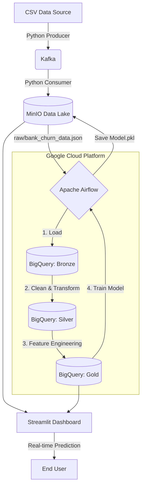

#  Bank Churn MLOps Pipeline 

## Overview
This project is a production-grade MLOps pipeline that ingests customer data, processes it through a **Medallion Architecture** (Bronze, Silver, Gold), trains a Machine Learning model to predict customer churn, and serves real-time insights and predictions via an interactive dashboard.

The entire infrastructure is containerized using Docker, making it highly portable and easy to deploy locally or in the cloud.

## Architecture



## Tech Stack

- **Orchestration:** Apache Airflow
- **Streaming:** Apache Kafka & Zookeeper
- **Data Lake:** MinIO (S3-compatible object storage)
- **Data Warehouse:** Google BigQuery
- **Machine Learning:** Scikit-Learn (Random Forest), Pandas, Joblib
- **Dashboarding:** Streamlit, Plotly
- **Containerization:** Docker & Docker Compose
- **Language:** Python 3.9+

## Prerequisites

Before running this project, ensure you have:

- Docker Desktop installed and running
- A Google Cloud Platform (GCP) account with an active project
- BigQuery API enabled in your GCP project
- A GCP Service Account with `BigQuery Data Editor` and `BigQuery Job User` roles
- Download the JSON key and name it `bq-key.json`

##  Installation & Setup

### 1. Clone the Repository

```bash
git clone <your-repository-url>
cd <project-directory>
```

### 2. Configure Environment Variables

Navigate to the `docker/` directory and create a `.env` file based on the template below:

```env
# GCP Configuration
GCP_PROJECT_ID=your_gcp_project_id
GCP_DATASET=bank_churn_dataset

# MinIO Configuration
MINIO_ACCESS_KEY=minioadmin
MINIO_SECRET_KEY=minioadmin123
MINIO_BUCKET=bank-data

# Kafka Configuration
KAFKA_BOOTSTRAP_SERVERS=kafka:9092
KAFKA_TOPIC=bank_churn

# Airflow Configuration
AIRFLOW_UID=50000
```

### 3. Add Google Cloud Credentials

Place your downloaded `bq-key.json` file in the following directory:

```
docker/bq-key.json
```

> **Note:** Ensure the file is named exactly `bq-key.json` without a `.txt` extension.

### 4. Start the Infrastructure

From the `docker/` directory, build and start all containers:

```bash
docker-compose up -d
```

Wait 1-2 minutes for all services (Airflow, Kafka, MinIO, Postgres, Streamlit) to initialize.

##  How to Run the Pipeline

### Step 1: Ingest Data into the Data Lake

You can ingest data via the Kafka streaming simulation or use the direct fallback script.

**Option A: Direct Injection (Recommended for local testing)**

From the root of the project, run:

```bash
python scripts/direct_ingest.py
```

**Option B: Kafka Streaming Simulation**

Open two separate terminals at the project root:

```bash
# Terminal 1: Start the producer
python scripts/kafka_producer.py

# Terminal 2: Start the consumer
python scripts/kafka_consumer.py
```

### Step 2: Verify Data in MinIO

Open your browser and go to: http://localhost:9001

Log in with:
- Username: 
- Password: 

Navigate to the `bank-data` bucket. You should see a `raw/` folder containing `bank_churn_data.json`.

### Step 3: Trigger the Airflow DAG

1. Open the Airflow UI: http://localhost:8080
2. Log in with:
   - Username: 
   - Password: 
3. Find the `bank_churn_mlops` DAG
4. Toggle the switch to ON (it turns blue)
5. Click the Play (▶️) button to trigger a manual run
6. Click on the DAG name to watch the 4 tasks execute sequentially:
   - ✅ `load_bronze_layer`
   - ✅ `transform_silver_layer`
   - ✅ `transform_gold_layer`
   - ✅ `train_ml_model`

### Step 4: Explore the Streamlit Dashboard

Once the Airflow DAG completes successfully (all tasks are green):

- Open your browser and go to: http://localhost:8501
- Explore the **Analytics Dashboard** for EDA and KPIs
- Go to the **Churn Prediction** tab to input customer features and get real-time predictions from the trained Random Forest model


## Troubleshooting

| Issue | Solution |
|---|---|
| Airflow DAG not found | Ensure the file is named `bank_churn_mlops.py` and restart the scheduler: `docker-compose restart airflow-scheduler` |
| MinIO Connection Refused | Ensure you are using port `9000` for API/Python scripts and port `9001` for the Web UI |
| BigQuery 404 Error | Verify that the dataset `bank_churn_dataset` exists in your GCP project and is located in the `US` region |
| Kafka connection errors | Wait 30 seconds after starting containers for Kafka to fully initialize |

## Future Improvements

- Implement CI/CD pipelines for automated testing and deployment
- Integrate MLflow for advanced model tracking and registry
- Replace local Kafka with a managed service (e.g., Confluent Cloud) for production
- Implement model versioning and A/B testing capabilities
- Add monitoring and alerting with Prometheus + Grafana


## Author

Built with ❤️ by Hiba Chabbouh